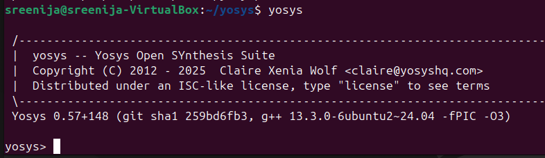
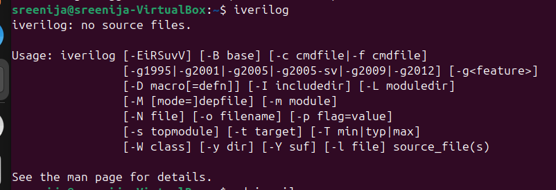
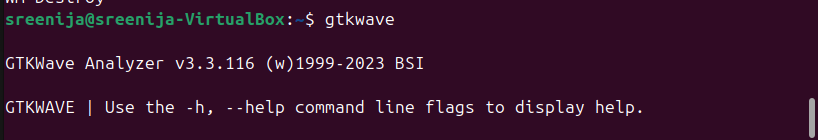
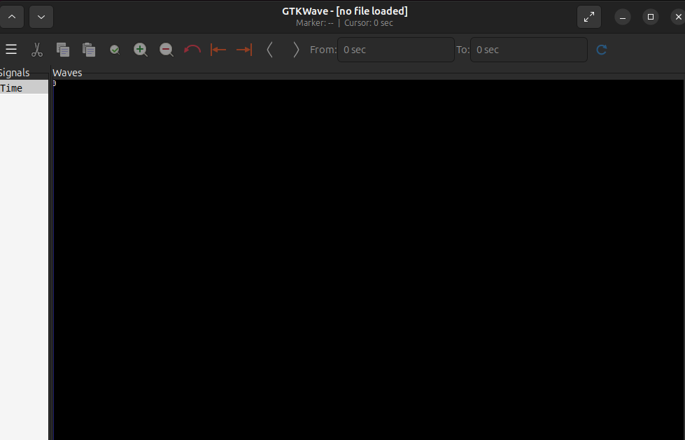

## Day 0
### TASK 1
### Summary:
We are using well known processors in our applications.Ever wondered how they are made?Here is the flow to design a processor:
Chip modelling: The GCC comiled code output(O1) is compared with specification based c environment compilation output(O2) where O1==O2
RTLarchitect: The O2 is compared with creating soft copy of hardware using RTL design output(O3) where O2==O3
Synthesis: The O3 is compared with synthesisable gate level netlist,macros and analog IP generates output(O4) where O3==O4
RTL-GDSII: The step where the soft copy hardware is converted into physical layout which gives netlist (O5), O4==O5
Tapeout: The generated GDSII file is then verified and checked using DRC and LVS(Physical Verification) O5==O6


### TASK 2
### <ins>Ubuntu setup and Tools Installation</ins>

### **System Requirements**
- 6 GB RAM
- 50 GB HDD
- Ubuntu 20.04 or higher
- 4 vCPU

### Ubuntu Setup
```
Oracle virtual machine link:https://www.virtualbox.org/wiki/Downloads
Ubuntu LTS version download link:https://ubuntu.com/download/desktop
```

### Resizing the ubuntu window to full screen
```
$ sudo apt update 
$ sudo apt install -y build-essential linux-headers-$(uname -r)
$ cd /media/sreenija/VBox_GAs_6.1.30 #open Guest Addition folder terminal
$ ./autorun.sh
```

### Tool Check
#### <ins>**Yosys**</ins>
```
$ sudo apt-get update
$ git clone https://github.com/YosysHQ/yosys.git
$ cd yosys
$ sudo apt install make  #If make is not installed please install it
$ sudo apt-get install build-essential clang bison flex \
 libreadline-dev gawk tcl-dev libffi-dev git \
 graphviz xdot pkg-config python3 libboost-system-dev \
 libboost-python-dev libboost-filesystem-dev zlib1g-dev
$ make config-gcc
$ make
$ sudo make install
```



#### <ins>iverilog</ins>
```
$ sudo apt-get update
$ sudo apt-get install iverilog
```


#### <ins>gtkwave</ins>
```
$ sudo apt-get update
$ sudo apt install gtkwave
```





